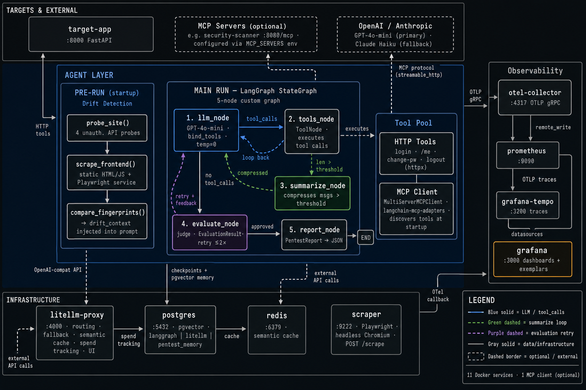
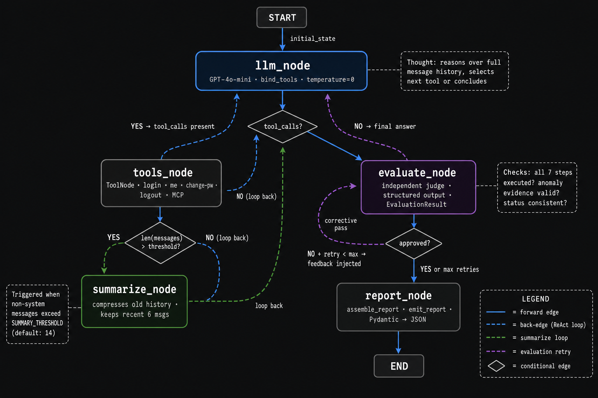

# Autonomous Pentesting Agent

An autonomous AI agent that performs a complete web application authentication
lifecycle test using a custom **LangGraph** graph (5 nodes) and **GPT-4o-mini**
via a **LiteLLM** proxy, with full observability via
**OpenTelemetry → Prometheus + Grafana Tempo → Grafana**.

## Architecture



```
┌──────────────────────────────────────────────────────────────────────────┐
│  Agent Container                                                         │
│  ┌────────────┐  ┌──────────────┐  ┌──────────────┐  ┌───────────────┐  │
│  │ llm_node   │  │ tools_node   │  │summarize_node│  │evaluate_node  │  │
│  │ GPT-4o-mini│  │ HTTP + MCP   │  │context window│  │independent    │  │
│  │ bind_tools │  │ async httpx  │  │compression   │  │judge + retry  │  │
│  └──────┬─────┘  └──────────────┘  └──────────────┘  └───────────────┘  │
│         │ drift_context + openapi_context ← probe (OpenAPI + HTTP + scrape)                    │
└─────────┼────────────────────────────────────────────────────────────────┘
          │
  ┌───────▼────────┐   ┌────────────────┐   ┌───────────────────┐
  │  target-app    │   │ litellm-proxy  │   │ postgres (pgvec)  │
  │  FastAPI :8000 │   │ :4000 + /ui    │   │ 3 DBs:            │
  └────────────────┘   └───────┬────────┘   │  litellm          │
                               │            │  langgraph        │
  ┌────────────────┐    ┌──────▼──────┐     │  pentest_memory   │
  │scraper service │    │   redis     │     └───────────────────┘
  │ Playwright :9222│   │ (sem.cache) │
  └────────────────┘   └─────────────┘
  ┌────────────────┐   ┌────────────────┐   ┌───────────────────┐
  │ otel-collector │   │  prometheus    │   │  grafana          │
  │ OTLP :4317     │──▶│  :9090         │──▶│  :3000            │
  └───────┬────────┘   └────────────────┘   └───────────────────┘
          │                                        ▲
          └──────────────────────────────────────▶ │
                   grafana-tempo (traces)           │
```

## Agent Graph



The agent uses a **custom LangGraph `StateGraph`** (not `create_react_agent`) with
five nodes and conditional edges:

```
START → llm_node → tools_node → [messages > threshold?] → summarize_node → llm_node
                 ↘ (no tool calls)
               evaluate_node → [approved?] → report_node → END
                             ↘ (feedback + retry ≤ 2×)
                           llm_node
```

| Node | Role |
|---|---|
| `llm_node` | Reasons over message history, selects next tool or concludes |
| `tools_node` | Executes all tool calls (HTTP + MCP) in the LLM's last message |
| `summarize_node` | Compresses old messages to prevent context window overflow |
| `evaluate_node` | Independent judge: validates completeness, evidence, consistency |
| `report_node` | Assembles and emits the final JSON report |

## Quickstart

### 1. Prerequisites

- Docker + Docker Compose v2
- An OpenAI API key (Anthropic optional — used as fallback)

### 2. Configure environment

```bash
cp .env.example .env
# Edit .env and set at minimum:
#   OPENAI_API_KEY=sk-...
#   AGENT_USERNAME=alice
#   AGENT_PASSWORD=Alice#2025
#   AGENT_NEW_PASSWORD=        # optional — random if blank
```

### 3. Run

```bash
docker compose up
```

The agent starts automatically once all dependencies are healthy. The full
flow (probe → scrape → login → change-password → logout → re-login →
evaluate → report) completes within 90 seconds under normal conditions.

### 4. View results

| Artifact | Where |
|---|---|
| **Report JSON** | `./output/report.json` (also logged at end of run) |
| **Trace ID** | Log line `agent.done` → paste in Grafana Explore → Tempo |
| **Site fingerprint** | pgAdmin → `pentest_memory` → `langchain_pg_embedding.cmetadata.site_fingerprint` |
| **OpenAPI contract** | http://localhost:8000/openapi.json or fingerprint `openapi` field |
| **Grafana dashboards** | http://localhost:3000 (no login required) |
| **LiteLLM UI** | http://localhost:4000/ui (master key: `sk-pentest-master`) |
| **Target Swagger UI** | http://localhost:8000/docs |

To run the agent again without restarting the whole stack:

```bash
docker compose restart target-app   # reset in-memory user passwords
docker compose run --rm agent
```

## Configuration Reference

| Variable | Required | Default | Description |
|---|---|---|---|
| `TARGET_BASE_URL` | Yes | — | Target FastAPI URL |
| `AGENT_USERNAME` | Yes | — | Test username |
| `AGENT_PASSWORD` | Yes | — | Initial password |
| `AGENT_NEW_PASSWORD` | No | (random) | New password; generated if blank |
| `OPENAI_API_KEY` | Yes | — | OpenAI API key |
| `ANTHROPIC_API_KEY` | No | — | Fallback LLM provider |
| `LITELLM_MASTER_KEY` | No | `sk-pentest-master` | LiteLLM gateway key |
| `LOG_LEVEL` | No | `INFO` | `DEBUG`, `INFO`, `WARNING` |
| `HTTP_TIMEOUT` | No | `10` | Per-request timeout (seconds) |
| `MCP_SERVERS` | No | `{}` | JSON map of MCP server configs |
| `SUMMARY_THRESHOLD` | No | `30` | Non-system messages before summarisation |
| `SUMMARY_RECENT_KEEP` | No | `12` | Recent messages kept verbatim after summarisation |
| `MAX_EVAL_RETRIES` | No | `2` | Max evaluation retry cycles before force-approve |
| `SCRAPER_BASE_URL` | No | `http://scraper:9222` | Playwright scraper microservice URL |
| `SCRAPER_STATIC_TIMEOUT` | No | `5` | Timeout for static HTML/JS fetches (seconds) |
| `SCRAPER_PLAYWRIGHT_TIMEOUT` | No | `20` | Timeout for Playwright page load (seconds) |

## Resume a Failed Run

Each run is assigned a `thread_id` (UUID). If the agent crashes mid-flow,
restart with the same thread ID to resume from the last checkpoint:

```bash
docker compose run agent --thread-id <uuid-from-logs>
```

## Memory Layers

| Layer | Technology | Purpose |
|---|---|---|
| Runtime | LangGraph messages | In-context tool call history (auto-compressed by `summarize_node`) |
| Short-term | LangGraph Checkpointer (PostgreSQL) | Resume after crash, idempotency |
| Long-term | pgvector (PostgreSQL) | Semantic search over past run reports + site fingerprints |

## Drift Detection

Before each run, the agent probes the target and builds a **`SiteFingerprint`**
combining three layers:

**Layer 1 — OpenAPI schema (always attempted)**
Fetches `/openapi.json`, extracts operations and parameter names, and stores the
full schema. On the next run, compares version, operations, and params for
contract-level drift. The summary is also injected into the system prompt under
**Discovered API Endpoints**.

**Layer 2 — API probe (always)**
Sends unauthenticated requests to each endpoint and records status codes and
JSON response schemas. Fast, zero overhead.

**Layer 3 — Frontend scrape (when the target serves HTML)**
- **Static:** fetches root HTML, detects SPA markers, downloads JS bundles and
  extracts API path strings via regex (`fetch()`, `axios`, `baseURL`)
- **Dynamic:** calls the Playwright microservice (`scraper:9222`) which renders
  the page with a headless Chromium browser, intercepts network requests, and
  returns the live DOM forms

The fingerprint is stored in pgvector alongside the report. On the next run it
is retrieved and compared. Any drift (changed status codes, new/removed form
fields, renamed endpoints, SPA type change) is formatted as a `drift_context`
block and injected into the system prompt so the LLM is aware before it starts.

A `structural_change` anomaly is recorded in the report if confirmed.

## MCP Integration

Extend the agent with external MCP servers by setting `MCP_SERVERS` in `.env`:

```bash
MCP_SERVERS='{"my-scanner": {"url": "http://my-mcp-server:8080/mcp", "transport": "streamable_http"}}'
```

Tools discovered from MCP servers are automatically added to the agent's tool
pool alongside the built-in HTTP tools.

## Development

### Run tests locally

```bash
pip install -r requirements.txt
pytest
```

### Run a single test

```bash
pytest tests/unit/test_tools.py -v
pytest tests/integration/test_integration.py -v
```

## Report Schema

```json
{
  "status": "success | partial_failure | failure",
  "steps": [
    {
      "name": "login",
      "status": "ok | error | skipped",
      "http_status": 200,
      "error_msg": null,
      "timestamp": "2026-05-23T11:00:00Z",
      "decision": null
    }
  ],
  "anomalies": [
    {
      "type": "session_not_invalidated",
      "description": "Token remained valid after /logout",
      "evidence": "GET /me returned HTTP 200"
    }
  ],
  "elapsed_ms": 1240,
  "thread_id": "550e8400-e29b-41d4-a716-446655440000",
  "evaluation": {
    "approved": true,
    "confidence": 0.95,
    "feedback": "All 8 steps executed with supporting evidence.",
    "missing_steps": [],
    "unsupported_anomalies": [],
    "suggested_actions": []
  }
}
```

### Anomaly types

| Type | Trigger |
|---|---|
| `weak_password_policy` | `/change-password` accepted without a valid `current_password` |
| `session_not_invalidated` | `GET /me` returned HTTP 200 after `/logout` |
| `token_not_rotated` | Re-authentication token identical to the initial token |
| `structural_change` | Endpoint missing, status changed, or form fields altered vs. previous run |

## Docker Services (11)

| Service | Port | Purpose |
|---|---|---|
| `target-app` | :8000 | Target application (black-box FastAPI) |
| `agent` | — | The pentesting agent |
| `scraper` | :9222 | Playwright microservice — dynamic frontend scraping |
| `litellm-proxy` | :4000 | AI Gateway: routing, fallback, cache, cost tracking |
| `postgres` | :5433 (host) / :5432 (internal) | Shared PostgreSQL instance — 3 app DBs + pgvector |
| `redis` | :6379 | LiteLLM semantic cache |
| `otel-collector` | :4317 | OTLP receiver → Prometheus + Tempo exporter |
| `prometheus` | :9090 | Metrics storage |
| `grafana-tempo` | :3200 | Distributed trace backend |
| `grafana` | :3000 | Unified observability dashboard |

## Observability

| Tool | Role | What to show in a demo |
|---|---|---|
| **Tempo** | Distributed trace storage | One `agent.run` trace — spans `pentest.login`, `agent.probe`, etc. |
| **Prometheus** | Time-series metrics | Scrape target health (`up` metric) on the Grafana dashboard |
| **Grafana** | Unified UI | Dashboard **Autonomous Pen Tester — Agent Overview** or Explore → Tempo with `trace_id` |

Each run logs a `trace_id` at startup (`agent.starting`) and completion (`agent.done`).
HTTP tools emit custom spans (`pentest.login`, `pentest.validate_session`, …) in
addition to auto-instrumented httpx spans.

**Database access (pgAdmin):** connect to `localhost:5433`, user/password `pentest`.
The default database `pentest` is empty (maintenance DB only). Application data
lives in `pentest_memory`, `langgraph`, and `litellm`.

See [docs/architecture-deep-dive.md](docs/architecture-deep-dive.md) §14 and
[docs/database-schema.md](docs/database-schema.md) for full details.

## Documentation

| Document | Contents |
|---|---|
| [docs/architecture-deep-dive.md](docs/architecture-deep-dive.md) | Full component breakdown, agent graph, memory, drift, observability |
| [docs/database-schema.md](docs/database-schema.md) | PostgreSQL schema for all 3 app databases + pgAdmin queries |
| [target-app/target-app/README.md](target-app/target-app/README.md) | Target API contract and seed users |

## Out of Scope

- Multi-user or concurrent session testing
- SQL injection, XSS, or active exploit payloads
- Persistent SIEM integration
